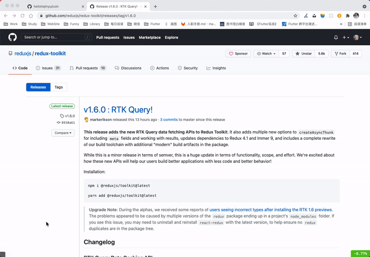

# 虚拟货币价格监听工具
Chrome 插件，监听虚拟货币实时价格（目前只支持比特币），左下角显示实时价格，右下角常驻显示 24H 涨幅。

# 使用
安装项目依赖，推荐使用 `yarn`，然后执行 `yarn build` 打包项目代码，最后在 Chrome 中导入 `dist` 目录文件即可。

# 开发
安装项目依赖，推荐使用 `yarn`，然后执行 `yarn dev` 启动开发服务。

# 预览

